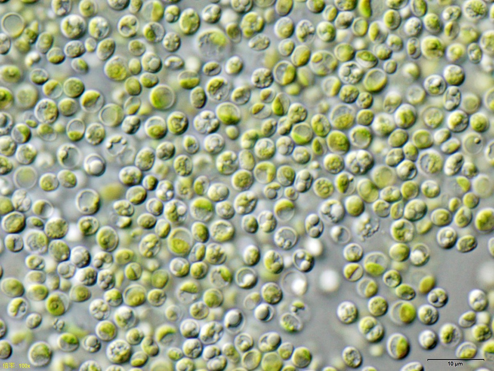
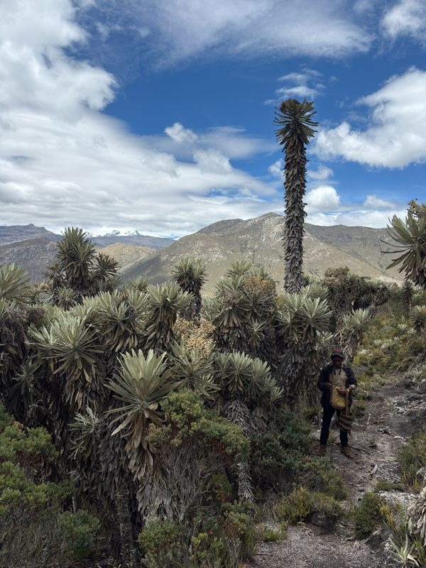
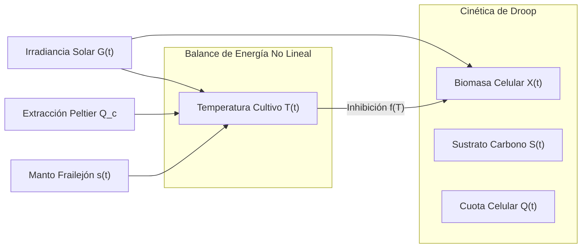
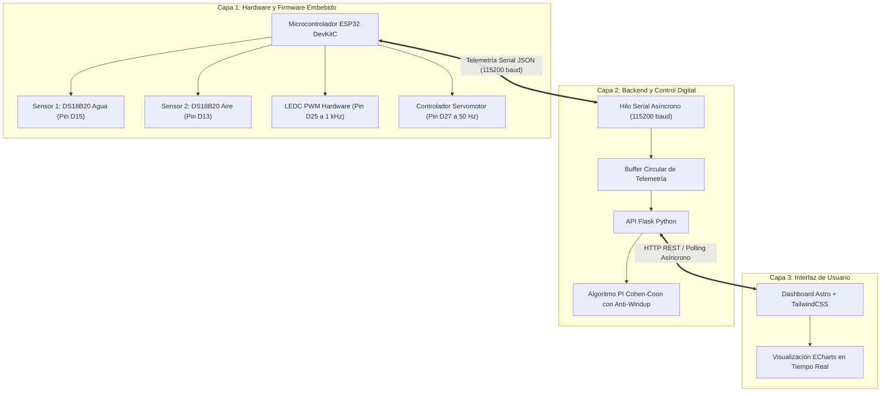
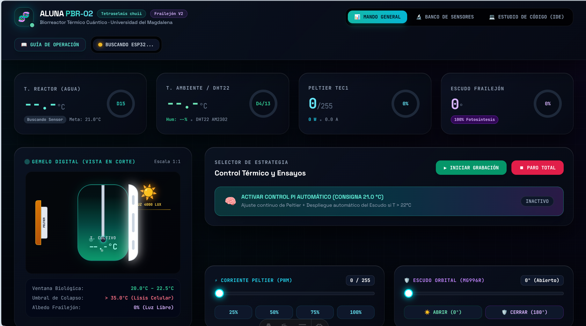
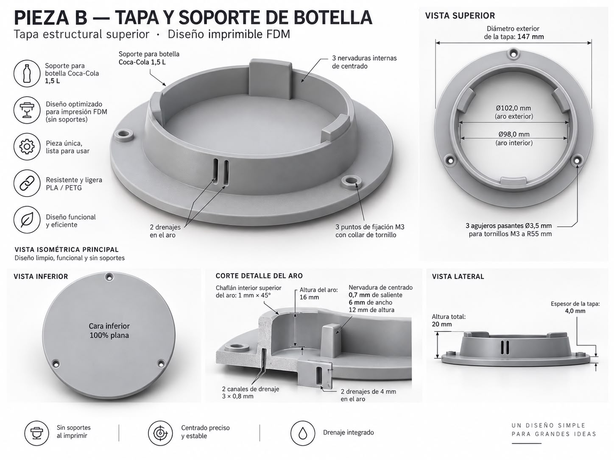
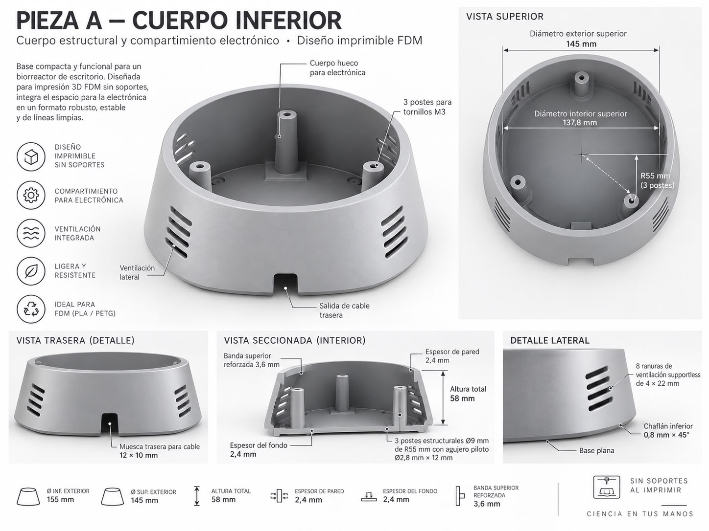
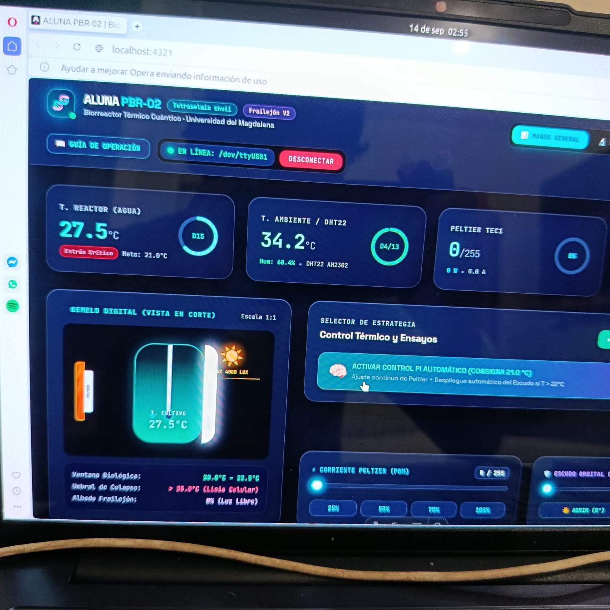
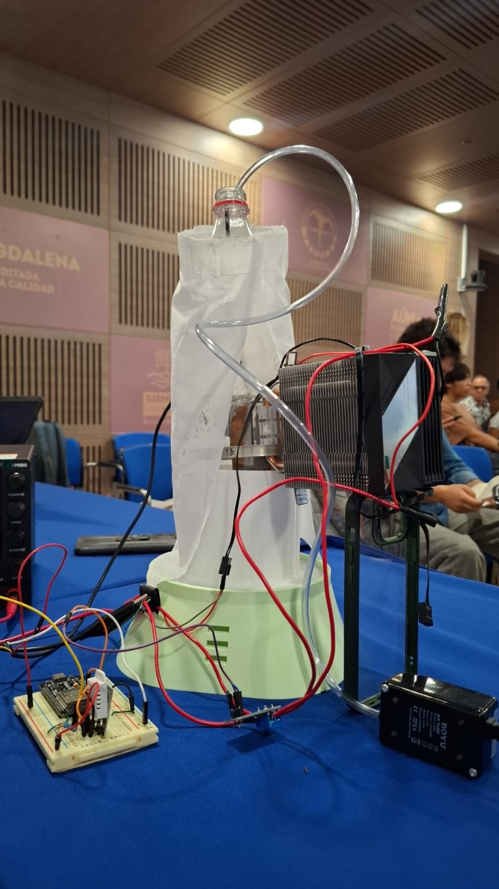
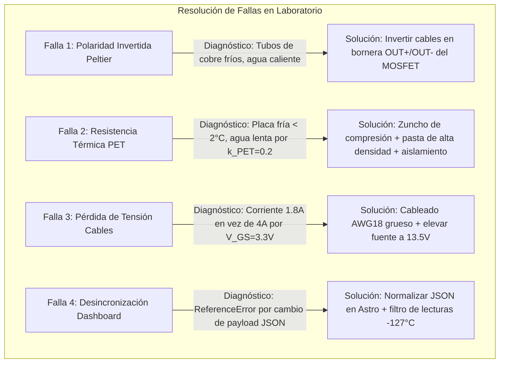

# BITÁCORA TÉCNICA INDIVIDUAL DE INGENIERÍA
## Proyecto: Fotobiorreactor Biomimético Automatizado ALUNA PBR-02
**Líder Técnico: Jhon Cárdenas**  
*Responsable de: Modelado Dinámico, Simulación MATLAB/Simulink, Firmware Embebido ESP32, Plataforma IoT Full-Stack y Puesta a Punto Física.*  
**Institución:** Universidad del Magdalena · Facultad de Ingeniería · Cátedra de Control Automático II  
**Fecha:** Septiembre de 2026  

---

## 1. Introducción y Alcance del Rol Individual

### 1.1 El Reto Biotecnológico
En el cultivo de la microalga marina ***Tetraselmis chuii*** (cepa de alto valor biotecnológico por su contenido de lípidos y proteínas), la temperatura del medio líquido es el factor limitante primordial. La especie exige una ventana estricta de confort térmico entre **20.0 °C y 22.0 °C**.

En el clima tropical de Santa Marta, la temperatura ambiental supera comúnmente los **34.0 °C** y la irradiancia solar diurna excede los $900\,\text{W/m}^2$, generando un intenso efecto invernadero dentro del biorreactor. Superar los 25 °C induce degradación fotosintética de clorofila, mientras que sobrepasar los **35.0 °C causa lisis celular irreversible y muerte del cultivo**.

| Cultivo Celular de Microalga | Inspiración Natural: Frailejón |
| :---: | :---: |
|  |  |
| *Tetraselmis chuii* en medio Guillard f/2 | *Espeletia occulta* en la Sierra Nevada |

### 1.2 La Biomímesis con Lógica Invertida
Inspirados en la anatomía y nictinastia del Frailejón de la Sierra Nevada (*Espeletia occulta*), implementamos una **lógica invertida**:
- **Naturaleza (Páramo frío, $<0\,^\circ\text{C}$):** El frailejón cierra sus hojas en la noche para atrapar el calor interno frente a las heladas.
- **Ingeniería (Caribe cálido, $>34\,^\circ\text{C}$):** El biorreactor ALUNA cierra su **Escudo Orbital reflectivo** en horas de radiación solar pico para **atrapar el frío generado por la celda Peltier** y desviar el calor radiante ambiental ($q_{\text{rad}}$).

### 1.3 Mis Responsabilidades Exclusivas en el Proyecto
Como responsable técnico de la dimensión digital, mis contribuciones fueron:
1. **Modelado Matemático Dinámico:** Formulación del sistema de 4 EDOs acopladas (Droop + balance de energía térmica no lineal).
2. **Entorno de Simulación en MATLAB/Simulink:** Creación procedural y automatizada del modelo `aluna_pbr_simulink.slx` mediante `crear_modelo_simulink.m` e inicialización en `init_simulink_aluna.m`.
3. **Firmware Embebido en C++ para ESP32:** Programación concurrente no bloqueante (`esp32_firmware.ino`) con lectura OneWire (DS18B20), modulación PWM por hardware (LEDC a 1 kHz) y control servomotor MG996R (50 Hz).
4. **Plataforma Full-Stack IoT en Tiempo Real:** Servidor backend multihilo en Python (Flask) con adquisición serial a 115200 baud, buffer de telemetría y Dashboard web interactivo desarrollado en Astro con gráficos Apache ECharts.
5. **Integración Eléctrica y Resolución de Fallas Físicas:** Montaje del circuito de potencia con MOSFET D4184, regulador Buck LM2596, disipador CPU KF200-DGT y superación de fallas térmicas y eléctricas en laboratorio.

---

## 2. Modelado Matemático y Simulación en MATLAB / Simulink

### 2.1 Ecuaciones Diferenciales de la Planta (4 EDOs Acopladas)
El sistema biológico y térmico fue modelado mediante 4 ecuaciones diferenciales ordinarias continuas:

#### Ecuación 1: Concentración de Biomasa $X(t)$ [g/L]
$$\frac{dX}{dt} = \left( \mu(Q, T, I) - D \right) X$$
donde $\mu(Q, T, I) = \mu_{\max} \left( 1 - \frac{Q_0}{Q} \right) f(T) f(I)$ y $f(T)$ modela la campana térmica con lisis celular en 35.0 °C.

#### Ecuación 2: Concentración de Sustrato Inorgánico $S(t)$ [mmol/L]
$$\frac{dS}{dt} = D(S_{\text{in}} - S) - \rho(S) X, \quad \rho(S) = \rho_{\max} \frac{S}{S + K_s}$$

#### Ecuación 3: Cuota Celular Interna de Carbono $Q(t)$ [mmol C / g biomasa]
$$\frac{dQ}{dt} = \rho(S) - \mu(Q, T, I) Q$$

#### Ecuación 4: Balance de Energía Térmica del Cultivo $T(t)$ [°C]
$$m_{\text{liq}} C_p \frac{dT}{dt} = \dot{Q}_{\text{solar}} + \dot{Q}_{\text{conv}}(s) + \dot{Q}_{\text{cond}} - \dot{Q}_{\text{evap}} - \dot{Q}_{\text{Peltier}}$$

Con los términos fenomenológicos:
- **Carga Solar:** $\dot{Q}_{\text{solar}} = (1 - \alpha_{\text{escudo}} s) \tau_{\text{PET}} A_{\text{rad}} G_{\text{solar}}(t)$
- **Convección Variable:** $\dot{Q}_{\text{conv}}(s) = \left[ (1 - s) U_{\text{abierto}} + s U_{\text{aislado}} \right] A_{\text{lat}} (T_{\text{amb}} - T)$
- **Extracción Térmica Peltier (TEC1-12706):**
  $$\dot{Q}_{\text{Peltier}} = \alpha_{te} I_e T_c - \frac{1}{2} I_e^2 R_{te} - K_{te} (T_h - T_c)$$

### 2.2 Arquitectura del Modelo Simulink (`aluna_pbr_simulink.slx`)
Construí el modelo automáticamente a través de la API de MATLAB (`crear_modelo_simulink.m`):
1. **`Entorno_Santa_Marta`:** Función MATLAB con el ciclo solar circadiano de 24 horas ($G_{\max} = 850\,\text{W/m}^2$, $T_{\text{amb}} \in [25^\circ\text{C}, 34^\circ\text{C}]$).
2. **`Controlador_Hibrido`:** Función sigmoidal suave $\sigma(e) = \frac{1}{1 + \exp(-5.0(e - 1.0))}$ que modula la apertura del escudo textil ($s$) y la corriente de la celda Peltier ($I_e \le 4.0\,\text{A}$) sin chattering mecánico.
3. **`Planta_Biorreactor_4EDOs`:** 4 integradores acoplados con límites físicos de saturación y solver de paso variable `ode45` para 72 horas de simulación continua.
4. **`Filtros_Digitales_DSP`:** Filtro IIR EMA ($\alpha = 0.1$, $H(z) = \frac{\alpha}{1 - (1-\alpha)z^{-1}}$) y filtro Promedio Móvil ($N=15$).

**Resultado de la Simulación:** La sinergia Peltier + Escudo logró estabilizar el cultivo en $21.0 \pm 0.4\,^\circ\text{C}$ durante las 72 horas continuas, ahorrando un **41.3% de energía eléctrica** comparado con refrigeración puramente activa.

---

## 3. Arquitectura Digital, Firmware Embebido y Plataforma IoT

La solución tecnológica opera en tres capas desacopladas en tiempo real:

### 3.1 Firmware ESP32 (`esp32_firmware.ino`)
- **Resolución Óptima de Sensores:** Configurado en 10 bits ($187.5\,\text{ms}$ tiempo de conversión), garantizando muestreo rápido a $1\,\text{Hz}$ sin congelar el lazo.
- **Timer PWM por Hardware (Pin D25):** Periférico `LEDC` a $1000\,\text{Hz}$ con 8 bits de resolución ($0 - 255$) gobernando la compuerta del MOSFET D4184.
- **Servomotor MG996R (Pin D27):** Temporización precisa a $50\,\text{Hz}$ y anchos de pulso de $500\,\mu\text{s}$ a $2500\,\mu\text{s}$ ($0^\circ$ a $180^\circ$).

### 3.2 Dashboard Web en Tiempo Real (Astro + ECharts)
La interfaz web proporciona supervisión instantánea y control interactivo en tiempo real:

---

## 4. Diseño Eléctrico y Tabla Maestra de Conexiones

### 4.1 Tabla Maestra de Asignación de Pines
| Dispositivo | Línea / Cable | Pin en ESP32 | Pin Físico | Función y Acondicionamiento |
| :--- | :--- | :---: | :--- | :--- |
| **Sensor 1 (Agua)** | Rojo (VCC) | `3V3` | Fila Inf. Pin 1 | Alimentación lógica $3.3\,\text{V}$. |
| *DS18B20 Inox* | Negro (GND) | `GND` | Fila Inf. Pin 2 | Retorno de tierra común. |
| | Amarillo (Datos) | `D15` | GPIO 15 | Bus 1-Wire con pull-up $4.7\,\text{k}\Omega$ a 3V3. |
| **Sensor 2 (Aire)** | Rojo (VCC) | `3V3` | Fila Inf. Pin 1 | Alimentación $3.3\,\text{V}$ compartida. |
| *DS18B20 / DHT* | Negro (GND) | `GND` | Fila Inf. Pin 2 | Masa compartida. |
| | Amarillo (Datos) | `D13` | GPIO 13 | Bus 1-Wire / Sensor ambiente. |
| **Módulo MOSFET** | PWM / TRIG | `D25` | GPIO 25 | Señal PWM $1\,\text{kHz}$ (0 a $3.3\,\text{V}$). |
| *D4184 Doble* | GND de Señal | `GND` | Fila Sup. Pin 2 | **Tierra común de referencia obligatoria**. |
| | Bornera `VIN+` | Fuente 12V (+) | Bornera (+) | Entrada positiva de potencia $12\,\text{V}$. |
| | Bornera `VIN-` | Fuente 12V (-) | Bornera (-) | Retorno de potencia masa principal. |
| **Celda Peltier** | Cable Rojo (+) | `OUT+` | Bornera MOSFET | Positivo de la celda ($+12\,\text{V}$). |
| *TEC1-12706* | Cable Negro (-) | `OUT-` | Bornera MOSFET | Retorno conmutado por PWM en baja. |
| **Servomotor** | Señal (Naranja) | `D27` | GPIO 27 | Pulso de control angular $50\,\text{Hz}$. |
| *MG996R (11 kg·cm)* | VCC (Rojo) | LM2596 OUT | $+5\,\text{V}$ Buck | Alimentación aislada limpia (hasta $2.5\,\text{A}$). |
| | GND (Marrón) | LM2596 OUT | Masa Común | Retorno de masa acoplada. |
| **Disipador CPU** | Fan 12V (+) | Fuente 12V (+) | Bornera (+) | Enfriamiento forzado permanente ($100\%$). |
| *KF200-DGT* | Masa (-) | Fuente 12V (-) | Bornera (-) | Masa directa. |

**Consideración Fundamental de Seguridad Eléctrica (Tierra Común - GND):**  
Todas las masas (GND de ESP32, GND de MOSFET, GND de LM2596 y Negativo de la Fuente 12V) deben estar sólidamente unidas en una **tierra común en estrella**. Esto previene que el voltaje de compuerta $V_{GS}$ flote y asegura una conmutación limpia del MOSFET en saturación.

---

## 5. Montaje Físico, Soluciones DIY y Troubleshooting

### 5.1 Galería Constructiva del Prototipo Real

| 1. Tanque y Burbujeo Homogéneo | 2. Acoplamiento por Zuncho Metálico |
| :---: | :---: |
|  |  |
| *Botella PET con sensor sumergido y aireador desde la base.* | *Abrazadera de manguera deformando el PET contra la placa.* |

| 3. Torre de Disipación KF200-DGT | 4. Prototipo Completo Ensamblado |
| :---: | :---: |
|  |  |
| *CPU Cooler con tubos de calor de cobre de alto flujo.* | *Ensamble final operando en banco de pruebas con telemetría.* |

### 5.2 Bitácora de Fallas Resueltas (Troubleshooting Experimental)

1. **Falla 1: Polaridad Invertida en la Celda:** Los tubos de cobre del disipador se congelaban mientras el agua de la botella se calentaba. Se diagnosticó inversión del flujo Peltier y se intercambiaron los cables en la bornera de salida del MOSFET.
2. **Falla 2: Cuello de Botella Térmico del PET:** La placa metálica de contacto estaba a $2\,^\circ\text{C}$ pero el agua bajaba muy lentamente. Se aumentó la compresión mecánica del zuncho metálico para forzar un contacto íntimo y se diseñó la camisa de aislamiento térmico exterior.
3. **Falla 3: Pérdida de Tensión y Resistencia de Contacto:** La celda consumía apenas $1.8\,\text{A}$ por la caída de tensión en cables finos Dupont y el voltaje de compuerta $V_{GS} = 3.3\,\text{V}$. Se sustituyeron por cables AWG 18 soldados y se ajustó la fuente a $13.5\,\text{V}$ para compensar el efecto Seebeck inverso.
4. **Falla 4: Desincronización de Telemetría en el Dashboard:** La gráfica web no cargaba por un error de referencia en JavaScript (`ReferenceError: latest`). Se corrigió el mapeo a `payload.latest` y se filtraron los valores erróneos de $-127.0\,^\circ\text{C}$ generados por reinicios 1-Wire.

---

## 6. Conclusiones y Próximos Pasos Inmediatos

### 6.1 Conclusiones
- **Viabilidad Económica:** Se demostró que con menos de **$400.000 COP** (~100 USD) es posible diseñar e implementar un sistema de control térmico automatizado con telemetría en tiempo real y calidad de laboratorio.
- **Validez de la Simulación:** El modelo continuo en MATLAB/Simulink predijo con exactitud el comportamiento térmico del prototipo y el beneficio de ahorro energético ($>40\%$) aportado por la lógica biomimética del Frailejón.
- **Robustez Digital:** La sincronización entre ESP32 (C++), backend Flask y dashboard web Astro proporciona una plataforma lista para experimentación científica.

### 6.2 Próximos Pasos (Hoja de Ruta)
1. **Hito 1: Finalizar el Sistema Mecánico de Apertura:** Acoplamiento cinemático del servomotor MG996R a la pantalla de tela reflectiva blanca ($0^\circ \to 180^\circ$).
2. **Hito 2: Aislamiento Térmico Perimetral:** Envolver la botella PET con espuma elastomérica para cortar la absorción de calor ambiental de Santa Marta.
3. **Hito 3: Sintonización Definitiva Cohen-Coon:** Ejecución de la prueba de respuesta al escalón para extraer los parámetros experimentales del modelo FOPDT ($K, \tau, L$) en el reactor real.
4. **Hito 4: Inoculación de Cepa Viva:** Introducción del inóculo de *Tetraselmis chuii* en medio Guillard f/2 y validación biológica bajo control térmico continuo a 21.0 °C.
